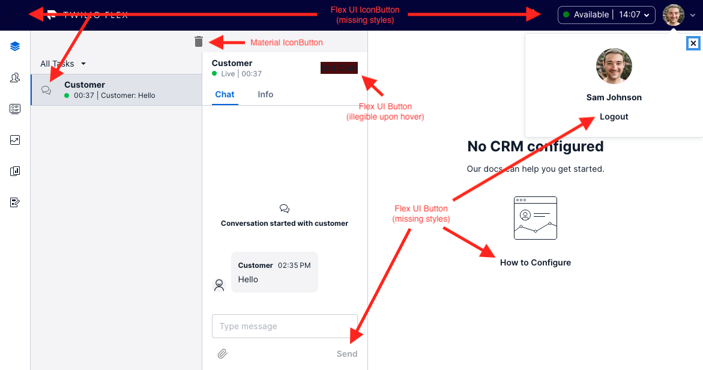
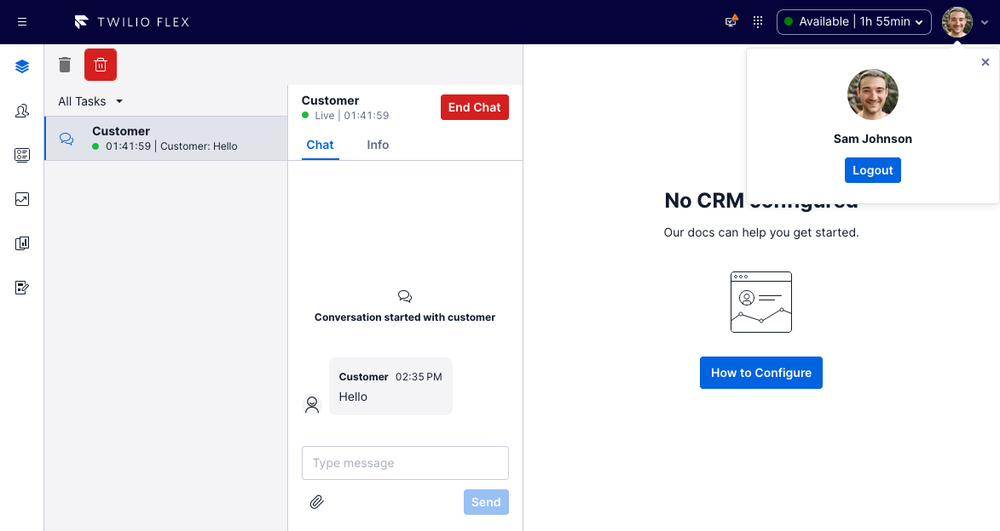

# Material UI + Paste in Flex UI 2.0 Example Plugin

When upgrading to Flex UI 2.0, existing Material UI based plugins will encounter rendering issues throughout the Flex UI whenever a Material UI component is mounted:



It is necessary to define a unique style provider and pass it to Flex to solve this issue:



This plugin serves as example code to demonstrate Material UI and Twilio Paste usage within the same plugin, which is necessary to allow a gradual migration strategy.

## What does it do?

This plugin adds the following code to the beginning of the plugin's `init` function. It is crucial that both `productionPrefix` and `seed` are unique per plugin to prevent style conflicts.

```
flex.setProviders({
  CustomProvider: (RootComponent) => (props) => {
    return (
      <StylesProvider generateClassName={createGenerateClassName({
        productionPrefix: PLUGIN_NAME,
        seed: PLUGIN_NAME
      })}>
          <RootComponent {...props} />
        </StylesProvider>
    );
  },
  PasteThemeProvider: CustomizationProvider
});
```

## Disclaimer

**This software is to be considered "sample code", a Type B Deliverable, and is delivered "as-is" to the user. Twilio bears no responsibility to support the use or implementation of this software.**

## Setup

Make sure you have [Node.js](https://nodejs.org) as well as [`npm`](https://npmjs.com). We support Node >= 10.12 (and recommend the _even_ versions of Node). Afterwards, install the dependencies by running `npm install`:

```bash
cd 

# If you use npm
npm install
```

Next, please install the [Twilio CLI](https://www.twilio.com/docs/twilio-cli/quickstart) by running:

```bash
brew tap twilio/brew && brew install twilio
```

Finally, install the [Flex Plugin extension](https://github.com/twilio-labs/plugin-flex/tree/v1-beta) for the Twilio CLI:

```bash
twilio plugins:install @twilio-labs/plugin-flex
```

## Development

Run `twilio flex:plugins --help` to see all the commands we currently support. For further details on Flex Plugins refer to our documentation on the [Twilio Docs](https://www.twilio.com/docs/flex/developer/plugins/cli) page.

